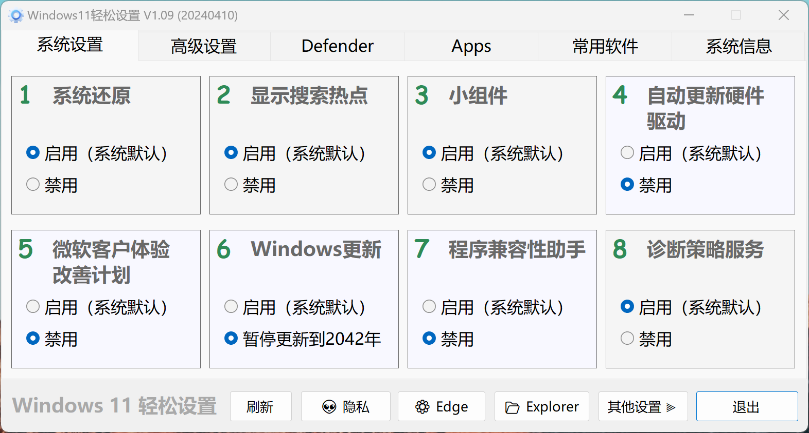

Win11轻松设置
优化难用的win11
#软件#Win11
md/w11qssz.jpg
2024-10-01
### [本地下载](https://rr.855955.xyz/Win11轻松设置.zip)
### 软件功能
一键禁用/恢复  
WD状态实时监测显示  
系统信息  
提供基本的软硬件信息。  
其他设置  
目前对文件资源管理器/任务栏可设置。  
快速打开常用系统功能。  
清除系统图标缓存。  
