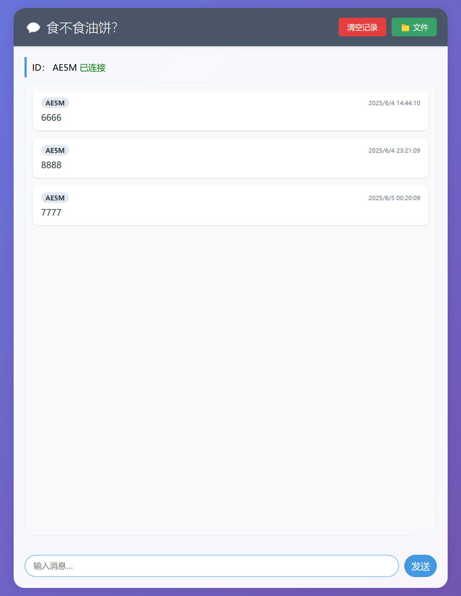

简单的网页聊天
部署一个简单的网页聊天工具，适合临时传文本，文件
#软件#分享
md/wyls.png
2025-06-01
# chat-app
#### 源码<https://github.com/zhou3636/chat-app>
## 致谢<https://claude.ai/>的代码
## 一个非常简单的临时聊天传文件的网页，只有几十k代码，无需安装客户端，有浏览器就行
## 可以部署在局域网或远程服务器
如需可反代套https
### 本人测试环境 Ubuntu 22
### 同理其他系统也可以，只需要懂node.js
### ！！！需要懂一点点命令行就行
#### 纪录可手动在网页端清空，默认密码1233，文件限制在500mb，可以在js和html代码里修改
.  
..  
...  


### 1. 创建项目
#### 把chat-app文件夹下载好，拖到你系统的根目录下就行了，给读写权限  

### 2. 安装Node.js和npm，依赖
win的电脑也可以安装，命令不一样
```
cd /chat-app
sudo apt update  
sudo apt install nodejs npm
sudo npm install  
```

### 3. 启动服务器
```
npm start
```

### 4. 访问应用
```
http://你的服务器IP:3000
```
#### 到这里就可以食用了

### 5. 开机启动
创建服务文件
```
nano /etc/systemd/system/chat-app.service
```
添加以下内容：
将 WorkingDirectory=/chat-app替换为你的实际路径
```
[Unit]
Description=Node.js Chat App Service
After=network.target

[Service]
Type=simple
User=root
WorkingDirectory=/chat-app
ExecStart=/usr/bin/npm start
Restart=on-failure
RestartSec=10
Environment=NODE_ENV=production
StandardOutput=syslog
StandardError=syslog
SyslogIdentifier=chat-app

[Install]
WantedBy=multi-user.target

```
#### 启用开机启动
```
sudo systemctl enable chat-app.service
```
### 6.可用反代套https，再加上密码认证
本人用Lucky <https://lucky.66666.host>，<https://ilucky.net> 做反代，web界面非常友好，一键开启访问密码。  
官网有一键命令，默认后台http://你的服务器IP:16601  
先在设置开启外网访问  
在ssl证书添加域名和证书  
在web服务添加反代  
--添加Web服务规则，监听类型勾选全部  
--添加子规则，服务类型选反向代理
--前端地址，你的地址  
--后端地址，127.0.0.1:3000  
--基本认证，打开，这就是打开网页需要密码了，
